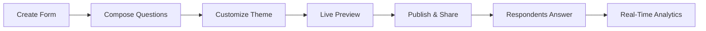
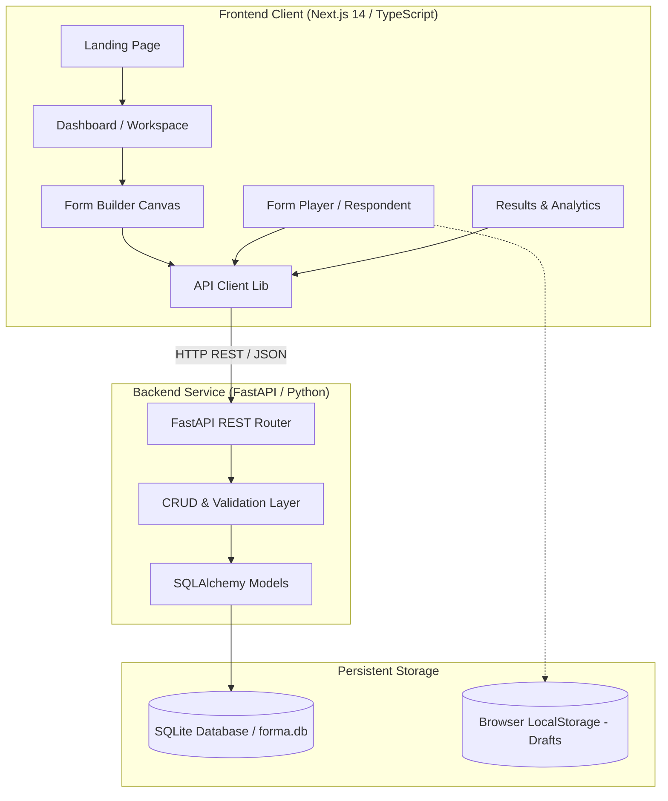
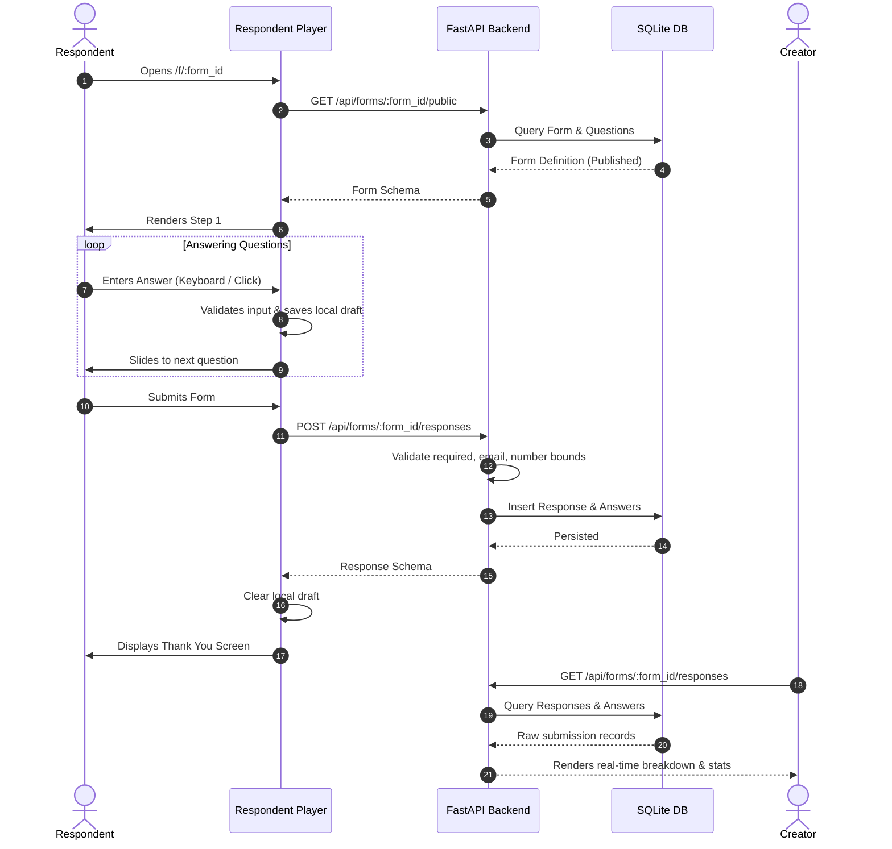
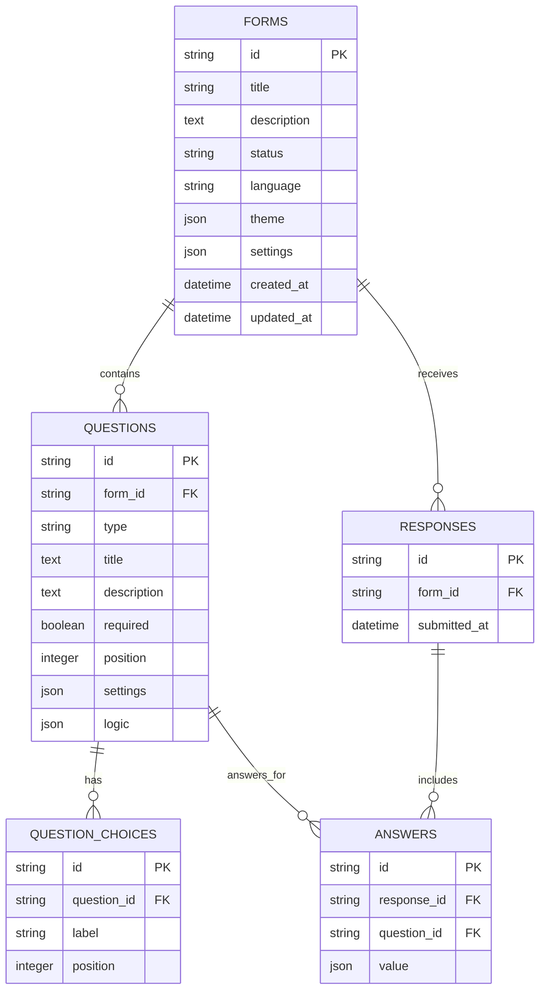

# Nomi

> **"Forms should feel like conversations."**

Nomi is a modern, Typeform-inspired conversational form platform designed to replace long, overwhelming web forms with focused, one-question-at-a-time dialogues that respondents actually enjoy completing.

---

## Table of Contents

- [Product Overview](#product-overview)
- [Core Workflow](#core-workflow)
- [Features](#features)
- [Tech Stack](#tech-stack)
- [System Architecture](#system-architecture)
- [System Flows](#system-flows)
- [Database Schema & ERD](#database-schema--erd)
- [API Documentation](#api-documentation)
- [Design System & Theme Architecture](#design-system--theme-architecture)
- [Key Engineering Decisions](#key-engineering-decisions)
- [Trade-Offs & Constraints](#trade-offs--constraints)
- [Testing & Quality Assurance](#testing--quality-assurance)
- [Local Development Setup](#local-development-setup)
- [Seed & Demo Data](#seed--demo-data)
- [Project Directory Structure](#project-directory-structure)
- [Assignment Compliance Checklist](#assignment-compliance-checklist)

---

## Product Overview

Traditional web forms present respondents with walls of inputs, leading to high abandonment rates and cognitive fatigue. **Nomi** reimagines data collection as an elegant conversational experience:

1. **Focused Pacing**: One question presented at a time with smooth animated transitions.
2. **Keyboard-First Interaction**: Full navigation and answering via `Enter`, arrow keys, letters (`A`–`D`), numbers (`1`–`9`), and `Y`/`N`.
3. **Real-Time Creator Studio**: WYSIWYG canvas, live responsive viewport toggling, customizable themes, and drag-and-drop reordering.
4. **Instant Actionable Analytics**: Real-time aggregation of submissions into metric cards, question-level distributions, and submission drill-downs.

---

## Core Workflow



1. **Create**: Initialize new forms in the workspace or duplicate existing forms.
2. **Design**: Customize palette, fonts, corner radius, text alignment, and progress bar styles.
3. **Preview**: Test conversational playback inside simulated mobile and desktop viewports with Escape hotkey exit.
4. **Publish**: Toggle public availability and copy the shareable link (`/f/:id`).
5. **Respond**: Anonymous respondents answer without authentication; partial answers automatically persist locally.
6. **Analyze**: Inspect aggregate metrics, choice distribution percentages, rating averages, and raw response payloads.

---

## Features

### Form Builder
- **8 Production-Ready Question Types**:
  - `short_text` — Single-line input with custom placeholder
  - `long_text` — Multi-line textarea (`Shift + Enter` for new lines)
  - `multiple_choice` — Single or multi-select with letter badges
  - `dropdown` — Clean select menu with searchability
  - `email` — Email format validation
  - `number` — Numeric input with configurable `min` and `max` bounds
  - `yes_no` — Quick binary selection
  - `rating` — Configurable steps (3–10) and shapes (`star`, `heart`, `number`)
- **WYSIWYG Canvas**: Direct inline editing of titles and descriptions.
- **Question Reordering**: Drag-and-drop handles and keyboard/mouse Move Up / Move Down buttons.
- **Inspector Panel**: Type-specific settings, placeholder overrides, required toggle, and choices manager.
- **Autosave Engine**: Debounced background persistence with visual save indicator (`Saved ✓` / `Saving...`).

### Respondent Experience
- **Fluid Conversational Flow**: Centered focus stage with slide animations.
- **Typeform-Style Keyboard Hotkeys**:
  - `Enter` to advance / submit
  - `ArrowUp` / `ArrowDown` to navigate steps
  - `A`, `B`, `C`, `D` / `1`, `2`, `3` for multiple choice
  - `Y` / `N` for Yes/No
  - `1`–`9` for Rating scores
- **Progress Tracking**: Top progress bar with configurable percentage (`75%`) or fraction (`03 / 04`) modes.
- **Anonymous Session Resume**: Form-specific `localStorage` draft saving with 7-day TTL and automatic cleanup on submission.
- **Strict Validation**: Real-time feedback for required fields, email syntax, and numerical range limits.
- **Customizable Thank-You Screen**: Tailored completion messaging per form.

### Workspace Dashboard
- **Form Management**: Grid and list views, search by title/description, and filter by status (`All`, `Published`, `Draft`).
- **Sorting**: Order by recently updated, recently created, or alphabetical title.
- **Quick Actions**: Publish/Unpublish toggle, atomic duplication, clipboard link copy, direct rename modal, and deletion with confirmation.

### Results & Insights
- **Overview Metrics**: Total responses, completion velocity, and live status.
- **Question-Level Breakdown**:
  - Choice percentages and visual progress bars for multiple choice & dropdown
  - Yes vs. No split bars
  - Rating average computation and star scaling
  - Number statistics (Average, Minimum, Maximum)
  - Latest text responses
- **Submissions Table**: Responsive tabular display with horizontal containment and detail inspection drawer.
- **Data Management**: Clear all responses with confirmation.

---

## Tech Stack

| Layer | Technology | Rationale |
|---|---|---|
| **Frontend Framework** | **Next.js 14** (App Router, React 18) | Server-side rendering, optimized routing, fast hydration |
| **Language** | **TypeScript 5** | Strict type safety across form schemas, theme tokens, and API contracts |
| **Styling** | **Tailwind CSS + Vanilla CSS Tokens** | Tailored design tokens, responsive breakpoints, smooth CSS keyframes |
| **Backend API** | **FastAPI (Python 3.10+)** | High performance, automatic OpenAPI documentation, asynchronous capabilities |
| **ORM & DB** | **SQLAlchemy 2.0 + SQLite** | Relational data integrity, cascade deletions, zero-configuration local portability |
| **Validation** | **Pydantic v2** | Strict schema parsing and validation for client/server payloads |
| **Testing** | **Python `unittest` + `TestClient`** | Automated backend integration test suite |

---

## System Architecture



---

## System Flows

### Form Submission & Analytics Flow



---

## Database Schema & ERD



### Relational Integrity
- **Cascade Deletions**: Deleting a form automatically cascades and deletes all associated questions, choices, responses, and answers.
- **Ordered Collections**: Questions and choices are strictly ordered by `position` integer ascending.
- **Flexible JSON Fields**: Theme configuration, question settings, and answer values utilize JSON storage for forward-compatible schema evolution.

---

## API Documentation

Base URL: `http://localhost:8000/api`

### Form Endpoints

| Method | Endpoint | Description | Status Code |
|---|---|---|---|
| `GET` | `/api/forms` | List all forms in workspace | `200 OK` |
| `POST` | `/api/forms` | Create a new form | `201 Created` |
| `GET` | `/api/forms/{id}` | Get complete form definition | `200 OK` / `404` |
| `PUT` | `/api/forms/{id}` | Update title, description, theme, settings | `200 OK` / `404` |
| `POST` | `/api/forms/{id}/duplicate` | Atomically duplicate form and questions | `201 Created` / `404` |
| `POST` | `/api/forms/{id}/publish` | Mark form as published | `200 OK` / `404` |
| `POST` | `/api/forms/{id}/unpublish` | Revert form to draft | `200 OK` / `404` |
| `DELETE` | `/api/forms/{id}` | Delete form and all responses | `200 OK` / `404` |

### Question Endpoints

| Method | Endpoint | Description | Status Code |
|---|---|---|---|
| `POST` | `/api/forms/{id}/questions` | Add a new question to a form | `201 Created` / `404` |
| `PUT` | `/api/questions/{id}` | Update question text, type, required, choices | `200 OK` / `404` |
| `PUT` | `/api/forms/{id}/questions/reorder` | Update question ordering positions | `200 OK` |
| `DELETE` | `/api/questions/{id}` | Delete question and reindex positions | `200 OK` / `404` |

### Respondent & Analytics Endpoints

| Method | Endpoint | Description | Status Code |
|---|---|---|---|
| `GET` | `/api/forms/{id}/public` | Fetch public form schema (requires published) | `200 OK` / `403` / `404` |
| `POST` | `/api/forms/{id}/responses` | Submit respondent answers | `201 Created` / `422` / `403` |
| `GET` | `/api/forms/{id}/responses` | Get all submissions for a form | `200 OK` / `404` |
| `DELETE` | `/api/forms/{id}/responses` | Clear all responses for a form | `200 OK` / `404` |

---

## Design System & Theme Architecture

### Nomi Visual Identity
Nomi's aesthetic blends warm, sophisticated tones with clean typography and atmospheric motion:
- **Palette**: Signature blush pink (`#c65a87`), warm white (`#fff9f8`), deep slate (`#0f172a`), obsidian dark mode (`#090d16`), and atmospheric purple glows.
- **Typography**: Editorial typography using *Plus Jakarta Sans* and *Inter* with strict hierarchy from large headlines (`40px`) down to micro-labels (`11px`).
- **Surface Depth**: Frosted glassmorphism (`backdrop-blur-md`), subtle borders (`rgba(150, 150, 150, 0.25)`), and soft drop shadows.

### Theme Presets
Creators can choose from curated themes or customize their own tokens:
1. **Nomi Default**: Clean, warm blush and indigo accents.
2. **Aurora**: Deep emerald dark mode with vibrant neon highlights.
3. **Midnight**: Ultra-dark obsidian canvas with electric cyan accents.
4. **Forest**: Organic sage and nature greens.
5. **Sunset**: Amber glow on warm cream backdrop.

---

## Key Engineering Decisions

1. **Shared `QuestionRenderer` Architecture**:
   The exact same component tree renders questions across the **Builder Canvas**, **Device Live Preview**, and **Public Respondent Player**. This guarantees that what creators design matches 100% with what respondents experience.
2. **Atomic Backend Duplication**:
   Duplicating a form is executed inside a single database transaction on the server (`POST /api/forms/:id/duplicate`), cloning the form, all question entities, choice rows, theme settings, and metadata atomically without multiple round-trips.
3. **Client-Side Draft Resume with Expiry**:
   Anonymous progress is preserved in `localStorage` under a form-scoped key (`forma_draft_{formId}`) with timestamp verification (7-day TTL). If the respondent finishes or the form is updated, the draft is purged cleanly without requiring user accounts.
4. **Dual Validation (Client & Server)**:
   Immediate client-side feedback prevents invalid jumps during the flow, while the backend verifies required fields, email regex, and numerical limits prior to inserting records into the database.

---

## Trade-Offs & Constraints

- **SQLite for Relational Storage**: Chosen for zero-configuration portability and assignment compliance. In high-concurrency production deployments with millions of concurrent writes, migrating to PostgreSQL with connection pooling (e.g., PgBouncer) would be recommended.
- **Anonymous `localStorage` Draft Persistence**: Ideal for privacy and friction-free anonymous responses without forcing respondent login. Trade-off: Drafts do not sync across different physical devices.
- **Simplified Creator Authentication**: The assignment scope prioritizes fullstack form construction, conversational UX, and real-time analytics; creator auth is intentionally streamlined.

---

## Testing & Quality Assurance

### Automated Backend Tests

The backend includes a comprehensive test suite in `backend/test_api.py` validating all API routes, status codes, reordering, validation errors, and cascading deletes.

To run the automated test suite:

```bash
cd backend
python -m unittest test_api.py
```

### TypeScript Compilation Check

Verify type integrity and compile correctness across all frontend components:

```bash
cd frontend
npx tsc --noEmit
```

### Verified Responsive Viewports

All views have been tested across standard device breakpoints:
- **Mobile Small**: 375 × 812 (iPhone SE / Mini)
- **Mobile Large**: 390 × 844 (iPhone 13 / 14 / 15)
- **Tablet Portrait**: 768 × 1024 (iPad Mini / Air)
- **Tablet Landscape**: 1024 × 768
- **Laptop / Desktop**: 1280 × 800, 1440 × 900

---

## Local Development Setup

### Prerequisites
- **Node.js** (v18+ recommended)
- **Python** (v3.10+ recommended)

### 1. Backend Setup

```bash
cd backend

# (Optional) Create and activate virtual environment
python -m venv venv
# On Windows:
.\venv\Scripts\activate
# On macOS/Linux:
source venv/bin/activate

# Install dependencies
pip install -r requirements.txt

# Seed the showcase demo form and sample responses
python seed.py

# Start the FastAPI server
uvicorn app.main:app --reload --port 8000
```

The backend server runs at `http://localhost:8000`. Interactive API documentation is available at `http://localhost:8000/docs`.

### 2. Frontend Setup

```bash
cd frontend

# Install npm packages
npm install

# Start development server
npm run dev
```

Open `http://localhost:3000` in your browser.

---

## Seed & Demo Data

The project includes a ready-to-run database seed script (`backend/seed.py`) that initializes:
- A showcase form (`eba8b334-7d15-42c0-b123-7f30686ff31b`) covering **all 8 question types**.
- 5 realistic sample submissions.
- Pre-populated analytics for choice distributions, rating score averages, and submission drill-downs.

To re-seed at any time:
```bash
cd backend
python seed.py
```

---

## Project Directory Structure

```
shorma/
├── backend/
│   ├── app/
│   │   ├── crud.py            # Database operations & validation
│   │   ├── database.py        # SQLAlchemy session & SQLite engine
│   │   ├── main.py            # FastAPI route handlers & CORS
│   │   ├── models.py          # SQLAlchemy ORM models
│   │   └── schemas.py         # Pydantic v2 schemas
│   ├── forma.db               # SQLite database file
│   ├── requirements.txt       # Python backend dependencies
│   ├── seed.py                # Database demo showcase seeder
│   └── test_api.py            # Automated integration test suite
├── frontend/
│   ├── src/
│   │   ├── app/               # Next.js App Router pages
│   │   │   ├── builder/[id]/  # Form builder studio
│   │   │   ├── dashboard/     # Workspace forms management
│   │   │   ├── f/[id]/        # Public conversational respondent
│   │   │   └── page.tsx       # Landing page with interactive demo
│   │   ├── components/
│   │   │   ├── builder/       # Builder canvas, sidebar, inspector, header
│   │   │   ├── fields/        # Shared question renderers (all 8 types)
│   │   │   ├── respondent/    # Conversational player, progress, nav, thank-you
│   │   │   └── results/       # Stats cards, breakdown charts, submissions table
│   │   ├── context/           # Toast notification context
│   │   ├── lib/               # API client, theme tokens, accessibility helpers
│   │   └── types/             # TypeScript definitions
│   ├── package.json           # Frontend dependencies & scripts
│   └── tailwind.config.ts     # Design tokens & animation utilities
├── .gitignore
└── README.md                  # Project submission documentation
```

---

## Assignment Compliance Checklist

| Requirement | Category | Status | Notes |
|---|---|:---:|---|
| **All 8 Question Types** | Core | ✅ | Short text, long text, multiple choice, dropdown, email, number, yes/no, rating |
| **Form Builder Studio** | Core | ✅ | WYSIWYG canvas, live editing, question inspector, add content modal |
| **Drag & Drop Reordering** | Core | ✅ | Drag handles + Move Up/Down buttons with server persistence |
| **Form CRUD Operations** | Core | ✅ | Create, read, update, rename, duplicate, and delete |
| **Publishing State Management** | Core | ✅ | Publish, unpublish, public link generator, access guard on draft forms |
| **Conversational Respondent Flow** | UX | ✅ | One-question-at-a-time, smooth slide transitions, large typography |
| **Keyboard Accessibility** | UX | ✅ | `Enter`, `Arrows`, `A-D`, `Y/N`, `1-9` ratings, `ESC` exits preview/drawers |
| **Draft Persistence & Resume** | UX | ✅ | Form-scoped `localStorage` draft saving with 7-day TTL and submission cleanup |
| **Response Validation** | Quality | ✅ | Required checks, email format validation, and number bounds (client & server) |
| **Results & Real-Time Analytics** | Core | ✅ | Metric cards, question-level distributions, submission table & detail drawer |
| **Theme Customization System** | Design | ✅ | Presets (Default, Aurora, Midnight, Forest, Sunset), custom colors, fonts, radius |
| **Responsive Design** | Design | ✅ | Tested and optimized across mobile, tablet, and desktop viewports |
| **Automated Backend Tests** | Technical | ✅ | Full test coverage via `python -m unittest test_api.py` |
| **Seed Demo Data** | Delivery | ✅ | `python seed.py` provisions complete 8-question showcase with sample responses |
| **Submission Documentation** | Delivery | ✅ | Architecture diagrams, ERD, API specs, decisions, and setup instructions |
