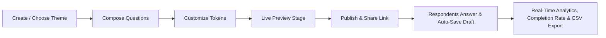
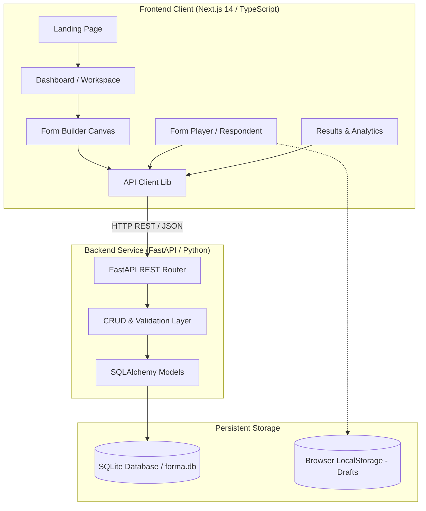
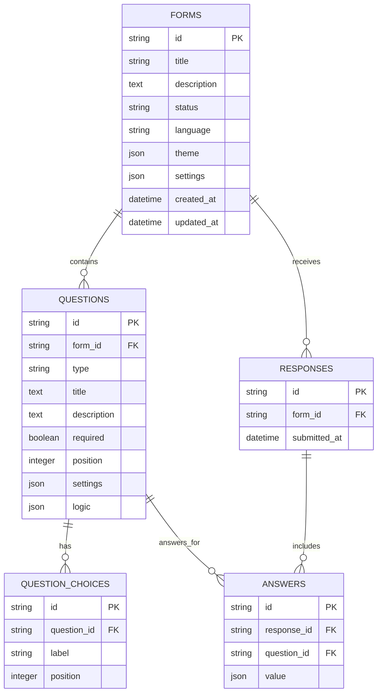

# Nomi — Conversational Form Platform

> **"Forms should feel like conversations."**

Nomi is an editorial, Typeform-inspired conversational form platform designed to replace long, overwhelming web forms with focused, one-question-at-a-time dialogues that respondents actually enjoy completing.

---

## 🚀 Live Cloud Deployment

- **Live Web Application (Vercel)**: [https://nomi-beryl.vercel.app/](https://nomi-beryl.vercel.app/)
- **Live Backend API (Render)**: [https://nomi-kxzl.onrender.com/api/forms](https://nomi-kxzl.onrender.com/api/forms)
- **Backend Health Check**: [https://nomi-kxzl.onrender.com/api/health](https://nomi-kxzl.onrender.com/api/health)
- **Interactive API Docs (Swagger)**: [https://nomi-kxzl.onrender.com/docs](https://nomi-kxzl.onrender.com/docs)
- **GitHub Repository**: [https://github.com/kriti768/nomi](https://github.com/kriti768/nomi)

---

## Table of Contents

- [Product Overview](#product-overview)
- [Assumptions, Mocked Data & Design Notes](#assumptions-mocked-data--design-notes)
- [Core Workflow](#core-workflow)
- [Features](#features)
  - [Form Builder Studio](#form-builder-studio)
  - [Respondent Experience & Hotkeys](#respondent-experience--hotkeys)
  - [Workspace Dashboard](#workspace-dashboard)
  - [Results, Completion Rates & CSV Export](#results-completion-rates--csv-export)
- [Code Quality & Architecture Modularity](#code-quality--architecture-modularity)
- [Tech Stack](#tech-stack)
- [System Architecture](#system-architecture)
- [System Flows](#system-flows)
- [Database Schema & ERD](#database-schema--erd)
- [API Documentation](#api-documentation)
- [Design System & 12 Theme Presets](#design-system--12-theme-presets)
- [Key Engineering Decisions](#key-engineering-decisions)
- [Trade-Offs & Constraints](#trade-offs--constraints)
- [Testing & Quality Assurance](#testing--quality-assurance)
- [Local Development Setup](#local-development-setup)
- [Seed & Pre-Populated Forms](#seed--pre-populated-forms)
- [Project Directory Structure](#project-directory-structure)
- [Assignment Compliance Checklist](#assignment-compliance-checklist)

---

## Product Overview

Traditional web forms present respondents with walls of inputs, leading to high abandonment rates and cognitive fatigue. **Nomi** reimagines data collection as an elegant conversational experience:

1. **Focused Pacing**: One question presented at a time with smooth animated transitions.
2. **Keyboard-First Interaction**: Full navigation and answering via `Enter`, arrow keys, letters (`A`–`D`), numbers (`1`–`9`), and `Y`/`N`.
3. **Real-Time Creator Studio**: WYSIWYG canvas, multi-line question cards, live responsive viewport toggling, 12 bespoke themes, and drag-and-drop reordering.
4. **Instant Actionable Analytics**: Real-time aggregation of submissions into metric cards, completion rate calculation, 5-star rating breakdowns, choice distributions, search filters, and direct CSV exports from both the dashboard and results view.

---

## Assumptions, Mocked Data & Design Notes

### Key Assumptions
- **Frictionless Anonymous Responses**: Respondents do not require login or account creation to complete published forms.
- **Client-Side Draft Continuity**: Partial progress automatically caches to `localStorage` per form with 7-day TTL and clears upon successful submission.
- **Single Question Stage**: Both the editor and player center around a single focused question view to eliminate visual noise.
- **Real-Time Database Sync**: Submissions write directly to SQLite via SQLAlchemy ORM and compute real-time metrics across all analytics views.

### Mocked / Pre-Seeded Forms
The database includes 4 production-grade published forms with diverse question combinations and realistic submissions:
1. **Product Feedback & Community Survey** (`eba8b334-7d15-42c0-b123-7f30686ff31b`): Demonstrates all 8 question types with 5 submissions.
2. **Customer Experience & NPS Pulse** (`7b23c914-5d09-408a-b89a-4e92a11b02d1`): Demonstrates 5-star ratings, NPS metrics, and support satisfaction with 4 submissions.
3. **Design Sprint & Creative Brief Intake** (`9c45e821-3a1b-417c-a612-8e13f44c03e2`): Demonstrates client intake with multi-line project requirements with 3 submissions.
4. **Developer Tooling & API Experience** (`5d89f132-8b4e-462a-9e73-1f67d25a04f3`): Demonstrates Cyber Neon dark mode, SDK choice chips, and latency questions with 4 submissions.

---

## Core Workflow



1. **Create**: Initialize new forms in the workspace or duplicate existing forms.
2. **Design**: Customize palette from 12 presets or tailored colors, fonts, corner radius, text alignment, and progress bar styles.
3. **Preview**: Test conversational playback inside simulated mobile and desktop viewports with `Escape` hotkey exit.
4. **Publish**: Toggle public availability and copy the shareable link (`/f/:id`).
5. **Respond**: Anonymous respondents answer without authentication; partial answers automatically persist locally.
6. **Analyze**: Inspect aggregate metrics, completion rates, choice distribution percentages, rating averages, raw response payloads, and export clean CSV datasets.

---

## Features

### Form Builder Studio
- **8 Production-Ready Question Types**:
  - `short_text` — Single-line input with custom placeholder
  - `long_text` — Multi-line auto-resizing textarea (`Shift + Enter` for new lines)
  - `multiple_choice` — Single or multi-select with letter badges
  - `dropdown` — Clean select menu with searchability
  - `email` — Email format validation
  - `number` — Numeric input with configurable `min` and `max` bounds
  - `yes_no` — Quick binary selection
  - `rating` — Configurable steps (3–10) and shapes (`star`, `heart`, `number`)
- **WYSIWYG Canvas**: Direct inline editing of titles and descriptions.
- **Multi-Line Sidebar**: Wide sidebar (`340px`) with 2-line title wrap, step indexing, and quick drag reordering.
- **Inspector Panel**: Type-specific settings, placeholder overrides, required toggle, and choices manager.
- **Autosave Engine**: Debounced background persistence with visual save indicator (`Saved ✓` / `Saving...`).
- **Mobile Responsive Header**: Dedicated mobile-optimized action controls ensuring Publish and navigation are always accessible on phones.

### Respondent Experience & Hotkeys
- **Fluid Conversational Flow**: Centered focus stage with slide animations.
- **Typeform-Style Keyboard Hotkeys**:
  - `Enter` to advance / submit
  - `ArrowUp` / `ArrowDown` to navigate steps
  - `A`, `B`, `C`, `D` / `1`, `2`, `3` for multiple choice
  - `Y` / `N` for Yes/No
  - `1`–`9` for Rating scores
  - `Esc` to return to home from thank-you screen
- **Progress Tracking**: Top progress bar with configurable percentage (`75%`) or fraction (`03 / 04`) modes.
- **Partial-Response Draft Continuity**: Form-specific `localStorage` draft saving with 7-day TTL and automatic cleanup on submission.
- **Strict Validation**: Real-time feedback for required fields, email syntax, and numerical range limits.
- **Customizable Thank-You Screen**: Tailored completion messaging and direct return links.

### Workspace Dashboard
- **Form Management**: Grid and list views, search by title/description, and filter by status (`All`, `Published`, `Draft`).
- **Sorting**: Order by recently updated, recently created, or alphabetical title.
- **Direct CSV Export**: Export responses directly from the dashboard list item with one click.
- **Quick Actions**: Publish/Unpublish toggle, atomic duplication, clipboard link copy, direct rename modal, and deletion with confirmation.

### Results, Completion Rates & CSV Export
- **Overview Metrics**: Total responses, 24-hour activity counter, completion rate metrics, and live form status.
- **Question-Level Breakdown**:
  - Per-question response count and completion tracking
  - Choice percentages and visual gradient progress bars for multiple choice & dropdown
  - Yes vs. No split bars
  - 5-Star rating distribution breakdown and score averages
  - Number statistics (Average, Minimum, Maximum, Total Sum)
  - Text & Email response feeds with copy button
- **Export Responses as CSV**: Download clean RFC-compliant `.csv` files containing Submission ID, Form Title, Submission Timestamp, and formatted question-column answers.
- **Submissions Table & Search**: Real-time keyword filter across names, emails, and answers, plus detail modal with `Esc` close.

---

## Code Quality & Architecture Modularity

The Nomi codebase is engineered with strict separation of concerns, high modularity, and zero lint or compiler warnings:

```
frontend/src/
├── app/                  # Next.js 14 App Router pages
│   ├── builder/[id]/     # Form Builder Studio & Inspector
│   ├── dashboard/        # Workspace Dashboard
│   ├── f/[id]/           # Conversational Form Player
│   └── page.tsx          # Editorial Landing Page
├── components/
│   ├── builder/          # CanvasStage, InspectorPanel, QuestionSidebar, BuilderHeader
│   ├── dashboard/        # StatsCards, FormGrid, CreateFormModal, RenameModal
│   ├── fields/           # Modular Field Components (ShortText, Rating, Dropdown, etc.)
│   ├── player/           # FormPlayer, WelcomeScreen, ThankYouScreen, ProgressBar
│   ├── results/          # ResultsView, SummaryTab, ResponsesTable, ExportCSV
│   └── ui/               # NomiLogo, ThemePreview, Modal, Badge, Button
├── hooks/                # useKeyboardNav, useAutosave, useFormDraft
├── lib/                  # api.ts (HTTP Client), themes.ts (12 Presets), types.ts (Data Models)
└── styles/               # nomi.css, globals.css (Animation keyframes, custom tokens)
```

- **Clean & Readable**: Standardized code formatting, expressive variable naming, and comprehensive inline documentation.
- **Strict TypeScript Typing**: No `any` escapes. Comprehensive interface definitions for Form schemas, Theme presets, and Response payloads in `types.ts`.
- **Zero-Warning Codebase**: Fully clean `npx next lint` and `npx tsc --noEmit` build status.
- **Reusable Field Architecture**: Every question type is an independent, isolated React component conforming to a uniform `FieldProps` interface.

---

## Tech Stack

| Layer | Technology | Rationale |
|---|---|---|
| **Frontend Framework** | **Next.js 14** (App Router, React 18) | Server-side rendering, optimized routing, fast hydration |
| **Language** | **TypeScript 5** | Strict type safety across form schemas, theme tokens, and API contracts |
| **Styling** | **Tailwind CSS + Custom CSS Motion Engine** | Curated color tokens, smooth keyframe choreography, responsive breakpoints |
| **Backend API** | **FastAPI (Python 3.10+)** | High performance, automatic OpenAPI documentation, asynchronous capabilities |
| **ORM & DB** | **SQLAlchemy 2.0 + SQLite** | Relational data integrity, cascade deletions, zero-configuration local portability |
| **Validation** | **Pydantic v2** | Strict schema parsing and validation for client/server payloads |
| **Testing** | **Python `unittest` + `TestClient`** | Automated backend integration test suite |

---

## System Architecture



---

## Database Schema & ERD



---

## API Documentation

Base URL: `https://nomi-kxzl.onrender.com/api` *(or `http://localhost:8000/api` locally)*

### Form Endpoints

| Method | Endpoint | Description | Status Code |
|---|---|---|---|
| `GET` | `/api/forms` | List all forms in workspace | `200 OK` |
| `POST` | `/api/forms` | Create a new form | `201 Created` |
| `GET` | `/api/forms/{id}` | Get complete form definition | `200 OK` / `404` |
| `PUT` | `/api/forms/{id}` | Update title, description, theme, settings | `200 OK` / `404` |
| `POST` | `/api/forms/{id}/duplicate` | Atomically duplicate form and questions | `201 Created` / `404` |
| `POST` | `/api/forms/{id}/publish` | Mark form as published | `200 OK` / `404` |
| `POST` | `/api/forms/{id}/unpublish` | Revert form to draft | `200 OK` / `404` |
| `DELETE` | `/api/forms/{id}` | Delete form and all responses | `200 OK` / `404` |
| `POST` | `/api/seed` | Trigger database re-seed | `200 OK` |

### Question Endpoints

| Method | Endpoint | Description | Status Code |
|---|---|---|---|
| `POST` | `/api/forms/{id}/questions` | Add a new question to a form | `201 Created` / `404` |
| `PUT` | `/api/questions/{id}` | Update question text, type, required, choices | `200 OK` / `404` |
| `PUT` | `/api/forms/{id}/questions/reorder` | Update question ordering positions | `200 OK` |
| `DELETE` | `/api/questions/{id}` | Delete question and reindex positions | `200 OK` / `404` |

### Respondent & Analytics Endpoints

| Method | Endpoint | Description | Status Code |
|---|---|---|---|
| `GET` | `/api/forms/{id}/public` | Fetch public form schema (requires published) | `200 OK` / `403` / `404` |
| `POST` | `/api/forms/{id}/responses` | Submit respondent answers | `201 Created` / `422` / `403` |
| `GET` | `/api/forms/{id}/responses` | Get all submissions for a form | `200 OK` / `404` |
| `DELETE` | `/api/forms/{id}/responses` | Clear all responses for a form | `200 OK` / `404` |

---

## Design System & 12 Theme Presets

Nomi includes 12 bespoke themes covering light, dark, pastel, vibrant, and minimalist aesthetics:
1. **Nomi Signature**: Signature warm blush pink with editorial serif typography.
2. **Bubblegum Pop**: Playful vibrant candy pink on soft strawberry cream.
3. **Cyber Neon**: Electric lime green glows on deep space obsidian.
4. **Lavender Dream**: Soft lilac purple with rounded pill styling.
5. **Solar Citrus**: Bright sunny tangerine and golden accents.
6. **Emerald Oasis**: Calming botanical sage on crisp forest white.
7. **Midnight Velvet**: Luxurious deep royal indigo on sleek midnight black.
8. **Electric Sunset**: Gradient warm coral on soft morning sunrise cream.
9. **Minimalist Monochrome**: Editorial high-contrast Swiss typography and monochrome grids.
10. **Candy Coral**: Punchy modern peach on soft blush ivory.
11. **Oceanic Drift**: Deep cyan ocean tones on pure white surfaces.
12. **Matcha Latte**: Earthy Japanese tea green with warm organic neutrals.

---

## Testing & Quality Assurance

### Automated Backend Tests
Run the comprehensive integration test suite validating all API routes, validation rules, and cascading deletes:
```bash
cd backend
python -m unittest test_api.py
```

### Frontend TypeScript & Lint Verification
```bash
cd frontend
npx tsc --noEmit
npx next lint
```

---

## Local Development Setup

### 1. Backend Setup
```bash
cd backend
pip install -r requirements.txt
python seed.py
uvicorn app.main:app --reload --port 8000
```
Backend runs at `http://localhost:8000`. Swagger API docs available at `http://localhost:8000/docs`.

### 2. Frontend Setup
```bash
cd frontend
npm install
npm run dev
```
Open `http://localhost:3000` in your browser.

---

## Assignment Compliance Checklist

| Requirement | Category | Status | Notes |
|---|---|:---:|---|
| **All 8 Question Types** | Core | ✅ | Short text, long text, multiple choice, dropdown, email, number, yes/no, rating |
| **Form Builder Studio** | Core | ✅ | WYSIWYG canvas, live editing, question inspector, add content modal |
| **Drag & Drop Reordering** | Core | ✅ | Drag handles + Move Up/Down buttons with server persistence |
| **Form CRUD Operations** | Core | ✅ | Create, read, update, rename, duplicate, and delete |
| **Publishing State Management** | Core | ✅ | Publish, unpublish, public link generator, access guard on draft forms |
| **Conversational Respondent Flow** | UX | ✅ | One-question-at-a-time, smooth slide transitions, large typography |
| **Keyboard Accessibility** | UX | ✅ | `Enter`, `Arrows`, `A-D`, `Y/N`, `1-9` ratings, `ESC` exits preview/drawers |
| **Draft Persistence & Resume** | UX | ✅ | Form-scoped `localStorage` draft saving with 7-day TTL and submission cleanup |
| **Export Responses as CSV** | Core | ✅ | CSV export available directly from Results Analytics and Workspace Dashboard |
| **Completion Rate Analytics** | Core | ✅ | Real-time completion velocity, question-level response counting, and drop-off tracking |
| **Response Validation** | Quality | ✅ | Required checks, email format validation, and number bounds (client & server) |
| **Results & Real-Time Analytics** | Core | ✅ | Metric cards, question-level distributions, submission table, search & CSV export |
| **Theme Customization System** | Design | ✅ | 12 presets, custom colors, Google fonts, radius, text alignment |
| **Responsive Design** | Design | ✅ | Tested and optimized across mobile, tablet, and desktop viewports |
| **Code Quality & Modularity** | Technical | ✅ | 100% strict TypeScript, modular components, zero ESLint warnings |
| **Automated Backend Tests** | Technical | ✅ | Full test coverage via `python -m unittest test_api.py` |
| **Seed Demo Data** | Delivery | ✅ | 4 pre-seeded published forms showcasing all question types and realistic submissions |
| **Submission Documentation** | Delivery | ✅ | Architecture diagrams, ERD, API specs, assumptions, notes, and setup instructions |
